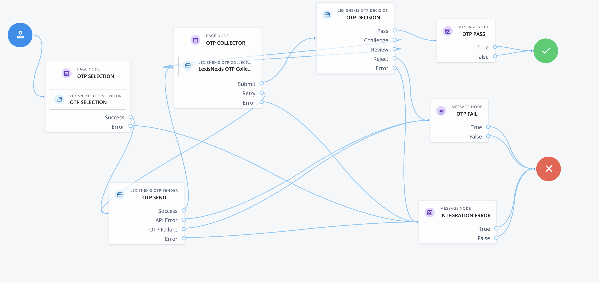
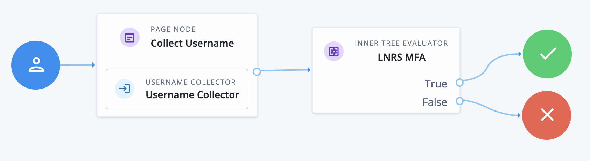

# LexisNexis Identity Proofing One-Time Passcode (OTP) Nodes
---
LexisNexis One Time Password is an out-of-band authentication method that provides business and government organizations the ability to have stronger authentication during a high risk, high value transaction with a customer. It offers a time-sensitive, unique random passcode via SMS text, email or phone and is ideal for companies that are interested in providing a multi-factor authentication solution for their customers. No hardware (electronic fob, etc.) other than the user's existing phone or personal computer is required. 

## Installation
For the on-premise PingAM / ForgeRock, LexisNexis One-Time Passcode (OTP) Nodes are packaged as a jar file that is to be installed within the web server. To deploy the jar file, perform the following:
- Download the jar from the releases tab on github [here](https://github.com/ForgeRock/lexisnexisrs-identity-proofing-docs/releases/latest). 
- Stop the web container to deploy the jar file
- Copy the jar into the `../web-container/webapps/openam/WEB-INF/lib` directory where PingAM / ForgeRock is deployed
- Restart the web container to pick up the new nodes
- Once restart is complete, the nodes will then appear in the authentication trees components palette.

## Backwards Compatibility
LexisNexis One-Time Passcode (OTP) Nodes have been tested with PingAM / ForgeRock v8.0, with backwards compatibility to v7.3, v7.4 and v7.5. Due to changes in the APIs, the LexisNexis OTP Nodes are not compatible with versions prior to v7.3. If support is needed for these versions, contact LexisNexis Risk Solutions.

## Quick Start Guide
In order to get started with the LexisNexis One-Time Passcode (OTP) Nodes, we have prepared Quick Start Guides:
- Click [here](./docs/LNRS-OTP-Nodes-Getting-Started-Guide-Cloud.pdf) to download a copy of the quick start guide for PingOne AIC / ForgeRock. 
- Click [here](./docs/LNRS-OTP-Nodes-Getting-Started-Guide-OpenAM.pdf) to download a copy of the quick start guide for PingAM / ForgeRock.

## Release Notes
To get the latest version of the LexisNexis One-Time Passcode (OTP) Nodes release notes, click [here](./docs/LNRS-OTP-Nodes-Release-Notes.pdf) 

# Node Overview
---
LexisNexis One-Time Passcode (OTP) Nodes provide the following:
- LexisNexis OTP Selector
- LexisNexis OTP Sender
- LexisNexis OTP Collector
- LexisNexis OTP Decision

## LexisNexis OTP Selector
This node will display a list of selections to the user for available methods to send an OTP code. LexisNexis OTP Nodes provide for email/OTP, SMS/OTP and voice/OTP. Upon user selection, the node will place the selected value into shared state variable <code>otp_type_select</code>. By default, this is the shared state variable that the LexisNexis OTP Send node accepts to determine which type of OTP to send to the end user. If only a single OTP type is configured, the node just sends the <code>otp_type_select</code> without any user interaction.

The LexisNexis OTP Selector node has the following configuration parameters:
* **Send Email** - When selected, this will display an Email Button on the selector interface.
* **Send SMS** - When selected, this will display an SMS Button on the selector interface.
* **Send Voice** - When selected, this will display an Voice Button on the selector interface.

The LexisNexis OTP Selector node has the following outcomes:
* **Success** - This outcome is triggered when a valid OTP Type is selected by the user.
* **Error** - This outcome is triggered when there is a fundamental integration error, or a new bug is discovered. First attempt to fix the integration error by looking at debug log files for the node to determine if the integration error is due to configuration. If the configuration looks accurate, then open a support case with LexisNexis Risk Solutions.

## LexisNexis OTP Sender
This node will send an API request to the LexisNexis Dynamic Decision Platform (DDP) authentication hub to send an OTP code to the end user. The node will inspect shared state for <code>username</code> and <code>otp_type_select</code>.  This combination of information defines the type of OTP to send to the defined user. The configuration of the node will define how additional attributes for the API request are fulfilled.

The LexisNexis OTP Sender Node has the following configuration parameters:
* **Org ID** - Org ID is the unique id associated your organization on the Dynamic Decision Platform (DDP).
* **API Key** - This is the unique API key generated via DDP Portal associated to the Org ID.
* **Base URL** - Defines the domain URL for the DDP/TMX region where API Requests are to be sent.  The default value is the global region.
* **Policy** - The DDP Portal policy to be used to integrate the DDP Authentication Hub with OTP.
* **OTP Length** - Length of the OTP. Valid values are between 6 and 10 characters.
* **OTP Expire** - Expiration time in minutes for the OTP. Valid values are between 1 and 60 minutes.
* **Email Title** - When Email/OTP is triggered, this will be the title of the email sent to the user.
* **Email Message** -When Email/OTP is triggered, this will be the message body of the email sent to the user.
* **SMS Message** - When SMS/OTP is triggered, this will be the message body of the SMS text message sent to the user. The SMS message has a maximum length of 160 characters.
* **Attribute Source** - Defines where the attributes for sending the OTP code is fetched at runtime. This is a dropdown list that contains the options User Directory and Shared State. User Directory will look for attribute in the Identity Store, and Shared State looks in the shared memory.
* **Email Attribute** - When Email/OTP is defined by the OTP Type, the attribute defined in this configuration parameter will be fetched by the name of the attribute provided based on the Attribute Source defined.
* **SMS Attribute** - When SMS/OTP is defined by the OTP Type, the attribute defined in this configuration parameter will be fetched by the name of the attribute provided based on the Attribute Source defined.
* **Voice Attribute** - When Voice/OTP is defined by the OTP Type, the attribute defined in this configuration parameter will be fetched by the name of the attribute provided based on the Attribute Source defined.

The LexisNexis OTP Sender Node has the following outcomes:
* **Success** - This outcome is triggered when the OTP code is successfully generated for the user. It is worth mention that generation does not guarantee delivery to the users device. Thus, the LexisNexis OTP Collector Node allows for retry in the event the user never receives the OTP code.
* **API Error** - This outcome is triggered when there is an issue with the API Request such as a network timeout or the service is unavailable.
* **OTP Fail** - This outcome is triggered when the API Request is rejected by the LexisNexis DDP Authentication Hub service. Within the debug logging for the node, the actual error codes will be written for offline analysis and triage of the issue.
* **Error** - This outcome is triggered when there is a fundamental integration error, or a new bug is discovered. First attempt to fix the integration error by looking at debug log files for the node to determine if the integration error is due to configuration. If the configuration looks accurate, then open a support case with LexisNexis Risk Solutions.

## LexisNexis OTP Collector
This node collects the OTP code sent to the user. The interface allows for submitting a OTP code for decision and validation, as well as the user can request the OTP code to be resent.

The LexisNexis OTP Collector Node has the following configuration parameters:
* **Message Body** - This is the message displayed to the user on the collector interface.  The variable ${otpDestination} will contain either an email address or phone number depending on the method selected by the user via the Lexis OTP Sender.
* **Help Text** - This is the help text displayed in the OTP text entry box for the user.
* **OTP Error Message** - Message displayed if user enters an incorrect OTP code
* **OTP Blank Message** - Message displayed if user attempts to submit a blank OTP code

The LexisNexis OTP Collector Node has the following outcomes:
* **Submit** - This outcome is triggered when the user selects the "Submit" button. When selected, this should then link to the LexisNexis OTP Decision node to validate the OTP Code being submitted. If the LexisNexis OTP Decision node detects a blank or invalid OTP code, then this node will be linked and the appropriate message will be displayed. The outcomes review and challenge from the LexisNexis OTP Decision are to link back to the LexisNexis OTP Collector.
* **Retry** - This outcome is triggered when the user wants to get a new OTP code by selecting the "Retry" button on the interface. This outcome should route back to the beginning of the OTP user workflow.
* **Error** - This outcome is triggered when there is a fundamental integration error, or a new bug is discovered. First attempt to fix the integration error by looking at debug log files for the node to determine if the integration error is due to configuration. If the configuration looks accurate, then open a support case with LexisNexis Risk Solutions.

## LexisNexis OTP Decision
This node verifies OTP codes entered by the user. In a typical authentication tree, the LexisNexis OTP Collector will precede this node.  The collector places the user entered and submitted OTP in shared state. Additionally, the LexisNexis OTP Sender will precede this node and the LexisNexis Collector Node that places the characteristics of the type of OTP into shared state.

The LexisNexis OTP Decision Node has the following configuration parameters:
* **Org ID** - Org ID is the unique id associated your organization on the Dynamic Decision Platform (DDP).
* **API Key** - This is the unique API key generated via DDP Portal associated to the Org ID.

The LexisNexis OTP Decision Node has the following outcomes:
* **Pass** - This outcome is triggered when the OTP code submitted by the user is validated so that MFA via OTP has passed.
* **Challenge** - This outcome is triggered when the OTP code fails to validate, and the number of retires has not been violated.
* **Review** - This outcome is triggered when the OTP code fails to validate due to blank OTP code entered.
* **Reject** - This outcome is triggered when OTP code validation is failed.
* **Error** - This outcome is triggered when there is a fundamental integration error, or a new bug is discovered. First attempt to fix the integration error by looking at debug log files for the node to determine if the integration error is due to configuration. If the configuration looks accurate, then open a support case with LexisNexis Risk Solutions.

# Configuring LexisNexis One-Time Passcode (OTP) Nodes
---
## Example Journey/Tree
The example depicted here is showing how to configure LexisNexis OTP Nodes. LexisNexis OTP Nodes are used for Identity proofing as well as a multi-factor authentication (MFA) of a user. This example workflow displays the OTP Selector to the user, sends the OTP code, collects the OTP code value from the user and then validates if the value is correct.

The detailed workflow is as follows:
- Page Node to display the OTP Method selection interface using the LexisNexis OTP Selector node. This configuration wraps the selector with page node so that detailed messages can be displays to the user as part of the interface. Success from the selector will place the variable <code>otp_type_select</code> into shared state.
- LexisNexis OTP Sender node will generate the OTP code to the end user. This node will inspect shared state for <code>username</code> and <code>otp_type_select</code>.  This combination of information defines the type of OTP to send to the defined user. The configuration of the node will define how additional attributes for the API request are fulfilled. For example, if the OTP type is email, then the Email Attribute will be fetched from either the User Directory or Shared state based on the configuration of the Attribute Source.
- Page Node to display the OTP Collection interface using the LexisNexis OTP Collector Node. This configuration wraps the selector with page node so that detailed messages can be displays to the user as part of the interface.
- LexisNexis OTP Decision Node to determine if the OTP collected from the user is valid.
- Page Nodes with messages and a single OK button that will display the results and/or error conditions.
 

## Example Journey/Tree
One-Time Passcode (OTP) technology is typically used to augment an orchestration for Identity Proofing or user MFA.  The example journey/tree above provides an example of the OTP workflow, which is an orchestrated workflow. 

A simple framework to exercise the authentication tree is to configure a page node with a username collector which will fulfill the dependency to have the attribute “username” being in shared state. Then an Inner Tree Evaluator Node can integrate the OTP journey/tree for a final outcome of authentication.
 

